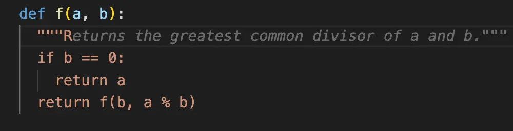
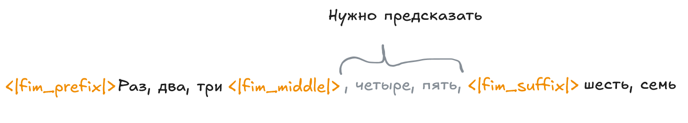
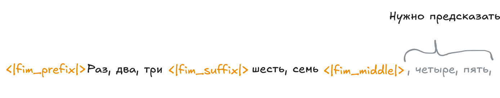

# Fill-in-the-Middle
Описание индустриально проекта по дообучению LLM для задачи FIM

- [Fill-in-the-Middle](#fill-in-the-middle)
  - [Что такое FIM?](#что-такое-fim)
  - [Предварительная подготовка](#предварительная-подготовка)
    - [Модуль оценки](#модуль-оценки)
    - [Модель](#модель)
    - [Датасет](#датасет)
  - [Предсказываем следующий токен](#предсказываем-следующий-токен)
  - [Хакаем награду](#хакаем-награду)
  - [Квантирование](#квантирование)

## Что такое FIM?
FIM (Fill in the middle) - задача `Text infilling` (заполнения пропусков) в середине некоторого контекста, основываясь на префиксе и суффиксе. Вайбкодеры наверняка уже пользовались такой штукой в IDE, и не с проста, большинство (если не все) таких моделей - кодерские и они заточены под автодополнение функций.



Если начать искать информацию про FIM модели - там все будет про код: и датасеты, и бенчмарки, и сами модели. А что если попробовать сделать такую модель для обычного текста? 


При обучении модели для задачи FIM, есть некторые особенности. Трансформеры - декодеры, смотрят на токены слева-направо, а "середина" распологается в середине (до суффикса) и если с этим ничего не сделать, то середина будет предсказываться только на основе префикса. В OpenAI уже давно придумали "как обмануть эту ракетку" - можно просто поставить середину в конец последовательности и тогда эта задача сводится к `Casual Language Modeling`, то есть предсказание следующего токена, а модель будет видеть и суффикс и префикс.


_Efficient Training of Language Models to Fill in the Middle - https://arxiv.org/pdf/2207.14255_

## Предварительная подготовка
Итак, в моем распоряжении было 2 видеокарты RTX A6000 на `Ampere` архитектуре (но в итоге я обучал на 1). Мне нужно было найти модель, датасет, изучить фремворки, написать код для обучения и наступить на некоторые грабли.

### Модуль оценки
Первое с чего я начал - это написание модуля оценки, чтобы при обучении понимать лучше или хуже я сделал. В итоге это очень сильно спасло перед тем как запускать основной цикл обучения:
- Оказывается в `Langhchain` по умолчанию стоит комплишен чата, а как его поменять непонятно, и если ты хочешь просто подавать последовательность по типу `<|fim_prefix|>Привет, ка<|fim_suffix|>у тебя?<|fim_middle|>` моделька начнет тебе выдавать ерунду с фразами ассистента
- Оказывается vLLM не поддерживает модели у которых, веса lora адаптеров смержены с основной моделью и ты их можешь запускать только как lora module
- Проверка на ранних чекпоинтах выявляла проблемы с остановкой генерации, галюцинаций модели и неудачные решения.

### Модель
Второе - это выбор модели и датасета. До этого я никогда не дообучал LLM, и не представлял себе сколько памяти для этого нужно. Оказывается для полного SFT вам нужно примерно x8 памяти от размера модели это не считая `batch_size` и активаций, например если модель 4B в fp16 это 2 байта на параметр ~ 8гб * 8 = 64гб. Тут и проявляется 1 проблема Ampere архитектуры - она не поддерживает fp8.

С учетом этого было решено обучать LoRA адаптеры, на модели побольше. На тот момент (февраль 2026 года), у Qwen последняя модель была 3 версии и там был примерно следующий разброс: Qwen/Qwen3-235B-A22B, Qwen3-30-A3B, Qwen3-14B, Qwen3-4B, Qwen3-0.6B

На самом деле выбор стоял между QLoRA для Qwen3-30-A3B и LoRA Qwen3-14B. Возиться с квантированием на обучении и МОЕ архитектурой, вообще не хотелось.

### Датасет
В качестве датасета, подойдет любой текст, который предназначен для SFT, плюс для удобства тестирования искался датасет на русском языке. На самом деле датасетов на русском языке на так много: это либо художественная литература, ру_википедия, TaigaCorpus или новости. Изначально я выбрал датасет новостей с Lenta.ru, после первого же чекпоинта, модель хорошо уловила всю суть Российских новостей и начала писать очень "криминально", про убийства, грабежи и т.д. Хотелось чего то более нейтрального и общего, и тут я нашел [датасет](https://huggingface.co/datasets/IlyaGusev/habr) - корпус статей на русском языке с хабра. 

Это был идеальный вариант - статьи довольно большие и по разным темам, у каждой свой контекст, и формат общих знаний.

Как происходила предобработка? Каждая статья разбивалась на чанки по 5000 символов ~ 1000 токенов. Не было задачи на основе 2-х предложений в начале и в конце предсказывать весь абзац, - была задача заполнять по 1 - 2 хороших предложения. Также заранее перед обучением каждый пример был токенизирован.

Что в итоге получилось:
- 666К примеров
- В каждом примере в среднем: 969.240 токенов
- Всего 613 636 744 токенов

Для SFT - 633К примеров
Для RLHF - 33К примеров

Но как примеры разбивались на prefix, middle, suffix? Изначально при обучении на новостях, обработка была немного другая, примеры не токенезировали, а сразу разбивали на части. Чанк разбивался на предложения, находилось центральное, дальше отступ влево и вправо на 1 - 2 предложения - вот и наша середина, все что слево от середины префикс, все что справа суффикс. У такого подхода оказался существенный минус - модель не могла предсказывать "обрезанные" части, ей нужно было подавать законченную часть предложения. Но для хабра примеры разбивались прямо во время обучения в функции `collate_fn`


## Предсказываем следующий токен
Итак как я уже писал, обучение строиться на том что мы добавляем специальные токены, для qwen3 это: `<|fim_prefix|>, <|fim_suffix|>, <|fim_middle|>`, меняем местами середину и суффикс и учим модель предсказывать все токены которые идут после `<|fim_middle|>`.

Разбиение на части было следующим:
```python
k = random.uniform(0.05, 0.1)
middle_size = max(10, min(90, int(n * k)))
``` 
Для каждого примера выбиралась доля - размер середины от длины последовательности, это позволяло добиться того чтобы модель дописывала обрезанные слова, заканчивала предложения и начинало писать новое. Сама середина определялась следующим образом, это влево и вправо от середины последовательности на `middle_size`. Получает что максимальный размер середины - 180 токенов - это два очень длинных предложения.

```python
middle = torch.tensor([TOKENIZER_FIM_MIDDLE] + ids[(n // 2) - middle_size:(n // 2) + middle_size] + [TOKENIZER_END])
```

Для обучения я использовал библиотеку `unsloth`, классная штука с оптимизацией по памяти. Параметры LoRA адаптеров были такие:
```python
model = FastLanguageModel.get_peft_model(
        model,
        r=32,
        lora_alpha=64,
        lora_dropout=0.05,
        target_modules=["q_proj", "k_proj", "v_proj", "o_proj", "gate_proj", "up_proj", "down_proj"],
    )
```
`unsloth` за меня посчитат сколько параметров обучалось: `Trainable parameters = 128,450,560 of 14,896,757,760 (0.86% trained)`

Основные параметры обучения, эффективный `batch_size` получился 16 это идеально помещалось в 48Gi RTX A6000 с небольшим запасом.
```python
per_device_train_batch_size=4,
gradient_accumulation_steps=4,
learning_rate=2e-4,
num_train_epochs=1,
bf16=True,
```

Лосс упал почти сразу, а перплексия не поднималась выше 5, что меня радовало.


## Хакаем награду

## Квантирование